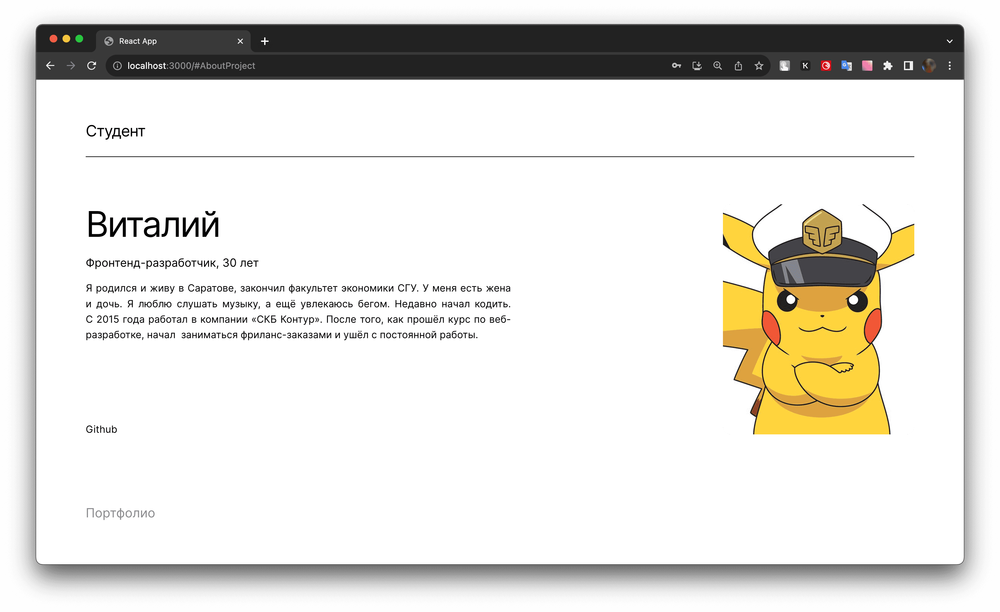

# movies-explorer-frontend

## Pull request

## Link

## Tech

## Navigation
* [Main](http://localhost:3000/) 
* [Result (Main)](http://localhost:3000/movies) 
* [Result (Saved)](http://localhost:3000/saved-movies) 
* [Profile](http://localhost:3000/profile) 
* [Sign Up](http://localhost:3000/signup ) 
* [Sign In](http://localhost:3000/signin) 
* [404](http://localhost:3000/404) 

## Layout

